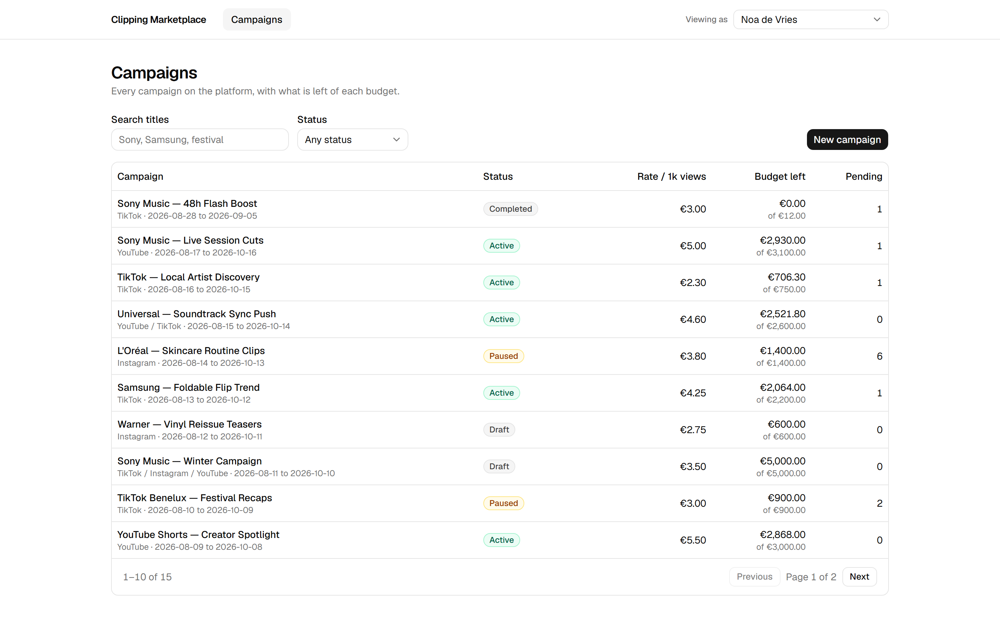
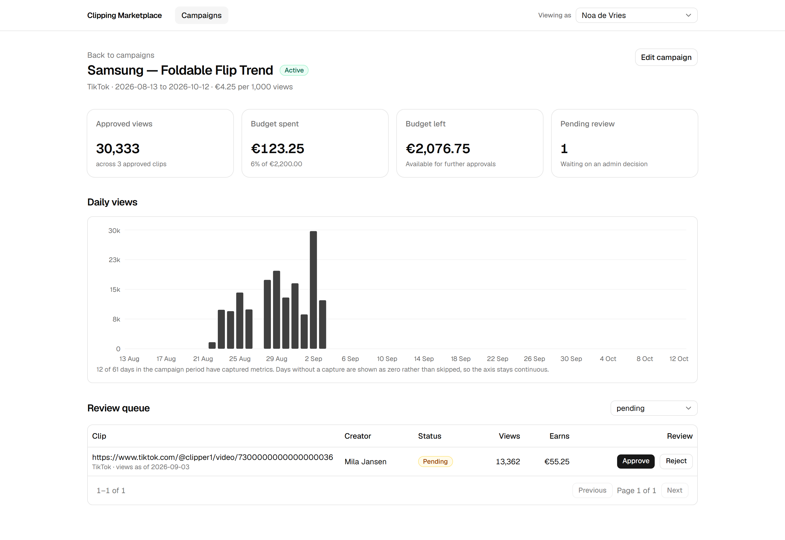
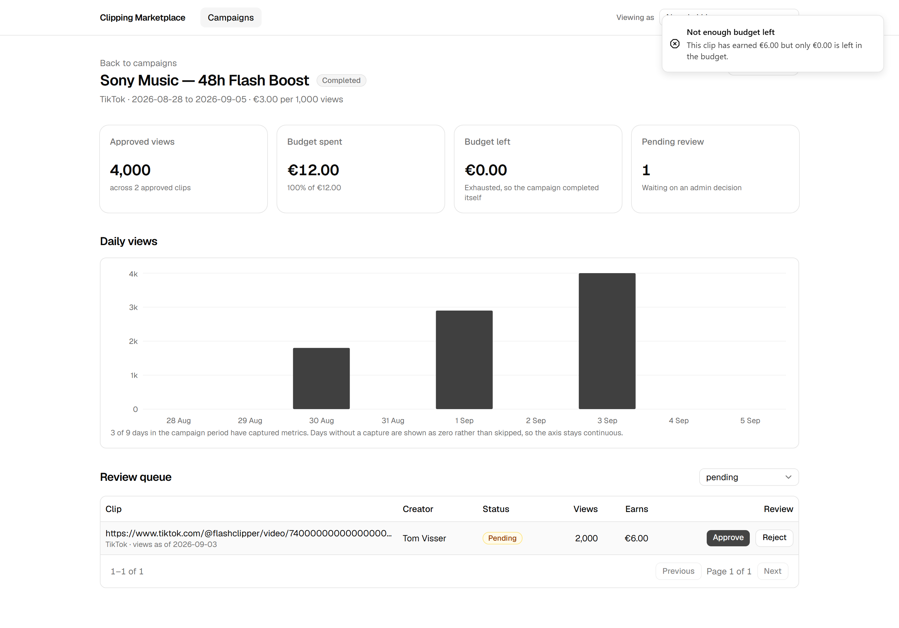
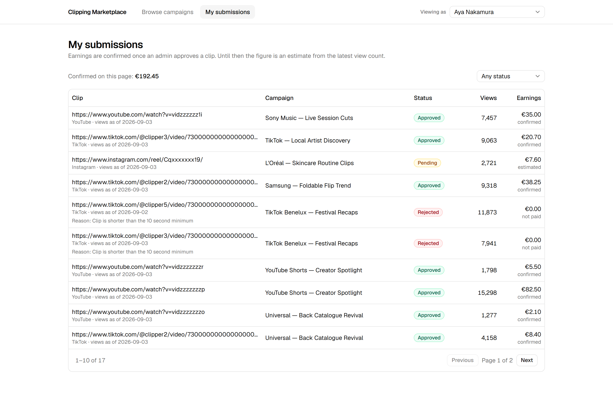
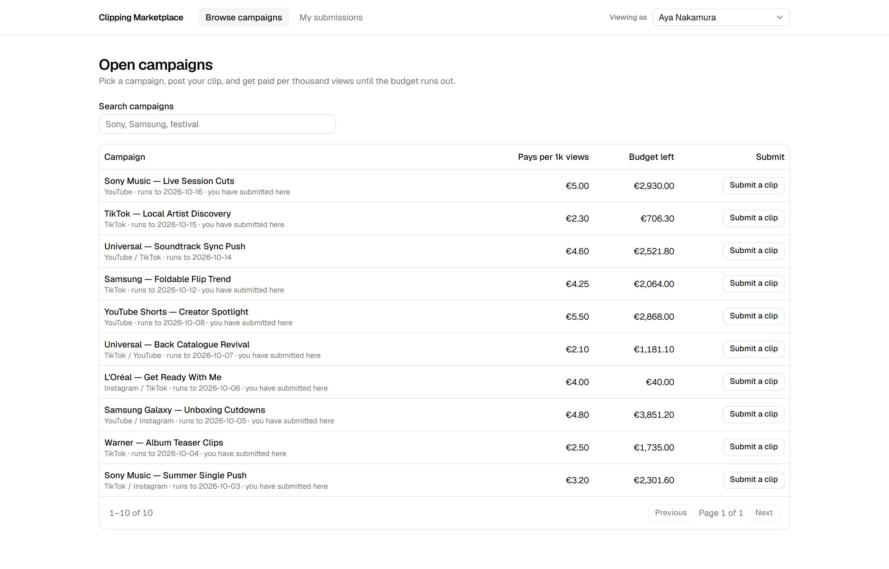

# Clipping Marketplace

**Live: [clipping-marketplace.vercel.app](https://clipping-marketplace.vercel.app)** — no sign-in,
pick a user from the switcher in the top right.

A cut-down paid clipping marketplace, built as a take-home assignment. Brands run
campaigns, creators submit short-form clips from TikTok, Instagram and YouTube, and
approved clips earn `floor(views / 1000) × payout_per_1k_views` — never more than the
campaign budget.

Real money moves through this flow, so the interesting parts are the edge cases: the
budget ceiling, two admins approving at the same moment, and a daily metrics sync that
has to be safe to run twice.

**[NOTES.md](./NOTES.md)** is the write-up: how concurrent approvals are handled, what was
ruled out along the way, the assumptions made, and what was left out on purpose.

## Screens

**Admin — campaign list.** Server-side pagination, title search and status filter, all
held in the URL so a filtered view is linkable.



**Admin — campaign overview and review queue.** Approved views, budget spent and left, and
daily views across the campaign period. The chart is built on `generate_series`, so days
nobody captured metrics for stay on the axis instead of collapsing it.



**The budget ceiling.** Approving a clip the budget cannot cover fails with a typed error
carrying the remaining and required amounts, so the UI can say exactly what happened. The
campaign that exhausted its budget closed itself.



**Creator — my submissions.** Earnings are committed once an admin approves; until then
they are an estimate from the latest view count, and a rejected clip is worth nothing.



**Creator — open campaigns.**



## Stack

Next.js 15 (App Router) · React 19 · TypeScript strict · tRPC v11 · Drizzle ORM on
Postgres 17 · TailwindCSS + shadcn/ui · react-hook-form + Zod · Vitest

## Running it

Needs Node 20+, pnpm and Docker.

```bash
pnpm install
docker compose up -d          # Postgres on localhost:5433
cp .env.example .env
pnpm db:migrate
pnpm db:seed
pnpm dev                      # http://localhost:3000
```

There is no sign-in, by design. Use the switcher in the top right to view the app as an
admin (`admin@wayv.test`) or a creator (`mila@creators.test` and three others).

```bash
pnpm test                     # 52 tests against a real Postgres
pnpm ingest                   # fake a daily metrics sync; safe to run twice
```

## Scripts

| Command | What it does |
| --- | --- |
| `pnpm dev` | Development server |
| `pnpm test` | Vitest against a real Postgres |
| `pnpm ingest [YYYY-MM-DD]` | Fake a daily metrics sync; idempotent per day |
| `pnpm db:generate` | Generate a migration from the schema |
| `pnpm db:migrate` | Apply migrations |
| `pnpm db:seed` | Reset and reseed the database |
| `pnpm typecheck` | `tsc --noEmit` |
| `pnpm lint` | ESLint |
